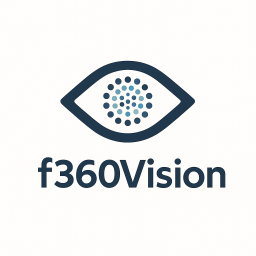

<div align="center">
	
</div>

# f360 Vision

**f360 Vision** is a comprehensive 3D point cloud visualization and measurement platform designed for industrial environments. It combines powerful 3D point cloud processing capabilities with panoramic imagery to provide an immersive visualization and analysis experience for factory floors, industrial facilities, and other complex environments.

## Overview

This project consists of multiple integrated components working together to provide a complete 3D visualization solution:

- **Web Application**: A modern frontend for viewing and interacting with 3D point clouds and panoramic images
- **Viewer Backend**: Serves processed 3D data and coordinates to the web application
- **Desktop Application**: Cross-platform desktop client

## Desktop App

Install the [latest version](https://github.com/factory360org/f360-vision/releases/latest) of the f360 Vision App for your operating system.

⚠️ Hint for Windows installations
> Make sure to set the path for .f360 files to a directory your Windows user has access to (e.g. Documents or Desktop).  
> Otherwise f360 Vision might not recognize .f360 files due to a lack of permissions

The default path for .f360 files on macOS is `/Users/<username>/Documents/f360 Vision`.

## Server hosting

### Requirements

Install [Docker](https://www.docker.com/) and make sure Docker is running.

### Setup

#### Linux / MacOS

```sh
curl -fsSL https://raw.githubusercontent.com/factory360org/f360-vision/main/unix/install.sh | bash
```

#### Windows

```powershell
# powershell
irm https://raw.githubusercontent.com/factory360org/f360-vision/main/winos/install.ps1 | iex
```

### Start

Run the start script with administrator / sudo rights. This will pull the Docker images and start the containers.

#### Linux / MacOS

```sh
./start.sh
```

#### Windows

```powershell
# powershell
./start.ps1
```

### Stop

Run the stop script.

#### Linux / MacOS

```sh
./stop.sh
```

#### Windows

```powershell
# powershell
./stop.ps1
```

### Update

**Update to latest version**  
Either remove `VERSION` from .env or set `VERSION=latest`

**Update to specific version**  
Update the `VERSION=vX.Y.Z` variable in the .env file and run the start script again.

## Usage

Once started, the system will be available at the configured endpoint.
Place the `.f360` files in the created `projects` directory.
