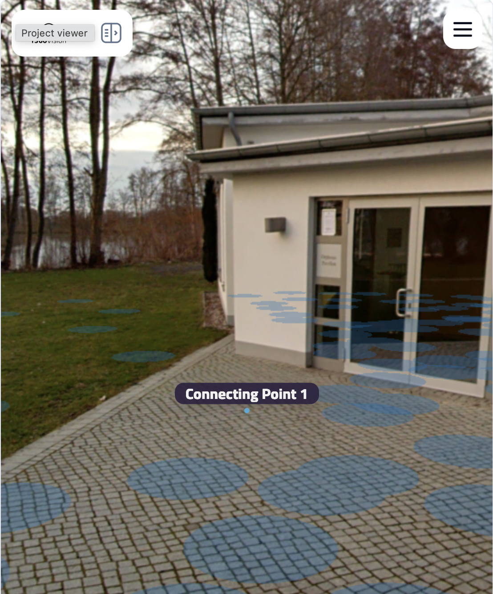

# Connecting Points – iframe integration

This document describes how to embed the F360 Vision viewer in an iframe on your page and interact with it via **connecting points**:
predefined or user-captured 3D positions in the point cloud that can be displayed, focused, and captured via `postMessage`.

---

## Preface

- Connecting points do not outlive a page reload. After a page reload the points have to be set again using `set-connecting-points`
- Do not worry about the point object. The object you receive from `point-captured` can be reused for `set-connecting-points`.
- The integration is available from version `1.1.7` and onwards
- Right after the message viewer-ready is sent the point-captured message is also sent each time the user clicks inside the pointcloud
- You can access the playground on your own installation of f360 vision docker image: http(s)://your-f360-vision.com/projects/<projectId>/test-sdk
  - [Demo Playground](https://demo.f360vision.com/projects/Demo-Building/test-sdk)



## 1. Embedding the viewer

Use an iframe whose `src` is the viewer URL for your project:

```
https://<viewer-origin>/projects/<project-id>
```

**Example**

```html

<iframe
    id="f360-viewer"
    title="F360 Vision Project Viewer"
    src="https://viewer.example.com/projects/abc-123"
    allow="fullscreen"
    style="width: 100%; height: 600px; border: 0;"
></iframe>
```

Replace `<viewer-origin>` with your F360 Vision viewer base URL and `<project-id>` with the project identifier.

---

## 2. Communication model

- **Channel:** [Window.postMessage](https://developer.mozilla.org/en-US/docs/Web/API/Window/postMessage)
- **Parent → viewer:** Send messages to the iframe with `iframe.contentWindow.postMessage(message, targetOrigin)`.
- **Viewer → parent:** The viewer posts messages to its own window. To receive them, the parent must listen for the `message` event on the *
  *iframe’s** `contentWindow` (not the parent’s `window`).

---

## 3. Messages you can send (parent → viewer)

All messages are plain objects with a `type` field. The viewer ignores messages that are not objects or do not have a valid `type`.

### 3.1 `set-connecting-points`

Set or replace the list of connecting points shown in the viewer (labels and markers).

| Field    | Type   | Required | Description                         |
|----------|--------|----------|-------------------------------------|
| `type`   | string | yes      | `"set-connecting-points"`           |
| `points` | array  | yes      | Array of point objects (see below). |

**Point object**

| Field             | Type        | Required | Description                                                                            |
|-------------------|-------------|----------|----------------------------------------------------------------------------------------|
| `position`        | `[x, y, z]` | yes      | 3D coordinates in the point cloud.                                                     |
| `id`              | string      | no       | Unique id. You may assign any string in order to reference it later when focusing a CP |
| `name`            | string      | no       | Label text. Assign any string the user then sees in the UI                             |
| `camera`          | object      | no       | Optional camera state used when focusing this point (see Camera object).               |
| `panoramaImageId` | string      | no       | Optional panorama image id for panorama-based focus.                                   |

**Camera object** (optional, used when focusing a point)

| Field      | Type        | Description      |
|------------|-------------|------------------|
| `position` | `[x, y, z]` | Camera position. |
| `yaw`      | number      | Yaw angle.       |
| `pitch`    | number      | Pitch angle.     |

**Example**

```javascript
iframe.contentWindow.postMessage(
    {
        type: 'set-connecting-points',
        points: [
            {
                id: 'cp-1',
                name: 'Entrance',
                position: // from point-captured
                camera: // from point-captured
                panoramaImageId: // from point-captured
            },
            {
                id: 'cp-2',
                name: 'Room A',
                ...
            }
        ]
    },
    'https://viewer.example.com'
);
```

---

### 3.2 `clear-connecting-points`

Remove all connecting points from the viewer.

| Field  | Type   | Required | Description                 |
|--------|--------|----------|-----------------------------|
| `type` | string | yes      | `"clear-connecting-points"` |

**Example**

```javascript
iframe.contentWindow.postMessage(
    { type: 'clear-connecting-points' },
    'https://viewer.example.com'
);
```

---

### 3.3 `focus-connecting-point`

Move the viewer’s camera to a specific connecting point (fly-to). If the point has `panoramaImageId`, the viewer may switch to panorama
view; if it has `camera`, that state is used; otherwise the point’s position is used.

| Field     | Type   | Required | Description                            |
|-----------|--------|----------|----------------------------------------|
| `type`    | string | yes      | `"focus-connecting-point"`             |
| `pointId` | string | yes      | `id` of the connecting point to focus. |

**Example**

```javascript
iframe.contentWindow.postMessage(
    { type: 'focus-connecting-point', pointId: 'cp-1' },
    'https://viewer.example.com'
);
```

---

## 4. Messages you receive (viewer → parent)

To receive these, listen for `message` on the iframe’s `contentWindow`.

### 4.1 `viewer-ready`

Sent once when the viewer has loaded and the connecting-points API is initialized. Use this before sending commands if you need to wait for
readiness.

| Field  | Type   | Description      |
|--------|--------|------------------|
| `type` | string | `"viewer-ready"` |

---

### 4.2 `point-captured`

Sent when the user clicks on the point cloud (without dragging) and a 3D position is successfully picked. You can use this to add new
connecting points or sync state with your app.

| Field             | Type        | Description                                                            |
|-------------------|-------------|------------------------------------------------------------------------|
| `type`            | string      | `"point-captured"`                                                     |
| `position`        | `[x, y, z]` | Picked 3D position in the original projection of the pointcloud        |
| `camera`          | object      | *(optional)* Camera state at capture time (see Camera object above).   |
| `panoramaImageId` | string      | *(optional)* Focused panorama image id at capture time, if applicable. |

**Example handler**

```javascript
function onMessage(event) {
    if (event.origin !== 'https://viewer.example.com') return;
    const data = event.data;
    if (!data || typeof data !== 'object' || !data.type) return;

    switch (data.type) {
        case 'viewer-ready':
            console.log('Viewer is ready');
            break;
        case 'point-captured':
            console.log('User captured point:', data.position, data.camera, data.panoramaImageId);
            // e.g. add to your list and send set-connecting-points
            break;
    }
}

const iframe = document.getElementById('f360-viewer');
iframe.contentWindow.addEventListener('message', onMessage);
```

**Note:** The viewer dispatches these events on its own window. When the viewer is in an iframe, the parent listens on
`iframe.contentWindow`; the `event` you get in the parent is the same message event, and `event.origin` is the viewer’s origin.

---

## 5. Recommended flow

1. **Embed** the viewer iframe (section 1).
2. **Listen** for `message` on `iframe.contentWindow`; validate `event.origin`.
3. **Optional:** Wait for `viewer-ready` before sending commands.
4. **Send** `set-connecting-points` to show initial points (or `clear-connecting-points` to start empty).
5. **Send** `focus-connecting-point` when the user selects a point in your UI.
6. **Handle** `point-captured` to add new points to your state and optionally call `set-connecting-points` again so the new point appears in
   the viewer.

---

## 6. TypeScript / type definitions (reference)

You can use these types in your integration:

```ts
interface ConnectingPoint {
    id: string;
    name: string;
    position: [number, number, number];
    camera?: {
        position: [number, number, number];
        yaw: number;
        pitch: number;
    };
    panoramaImageId?: string;
}

interface SetConnectingPointsMessage {
    type: 'set-connecting-points';
    points: Array<ConnectingPoint>;
}

interface FocusConnectingPointMessage {
    type: 'focus-connecting-point';
    pointId: string;
}

interface PointCapturedMessage {
    type: 'point-captured';
    position: [number, number, number];
    camera?: ConnectingPoint['camera'];
    panoramaImageId?: string;
}
```

---

## 8. Minimal example

```html
<!DOCTYPE html>
<html>
<head>
    <meta charset="utf-8">
    <title>f360 Vision – Connecting points</title>
</head>
<body>
<iframe
    id="viewer"
    src="https://viewer.example.com/projects/my-project-id"
    style="width:100%;height:80vh;border:0"
    title="Project viewer"
></iframe>

<script>
    const VIEWER_ORIGIN = 'https://viewer.example.com';
    const iframe = document.getElementById('viewer');

    iframe.addEventListener('load', () => {
        iframe.contentWindow.addEventListener('message', (event) => {
            if (event.origin !== VIEWER_ORIGIN) return;
            const d = event.data;
            if (d?.type === 'viewer-ready') {
                iframe.contentWindow.postMessage({
                    type: 'set-connecting-points',
                    points: [
                        { id: 'p1', name: 'Spot 1', position: [0, 0, 0] }
                    ]
                }, VIEWER_ORIGIN);
            }
            if (d?.type === 'point-captured') {
                console.log('Captured', d.position);
            }
        });
    });
</script>
</body>
</html>
```
